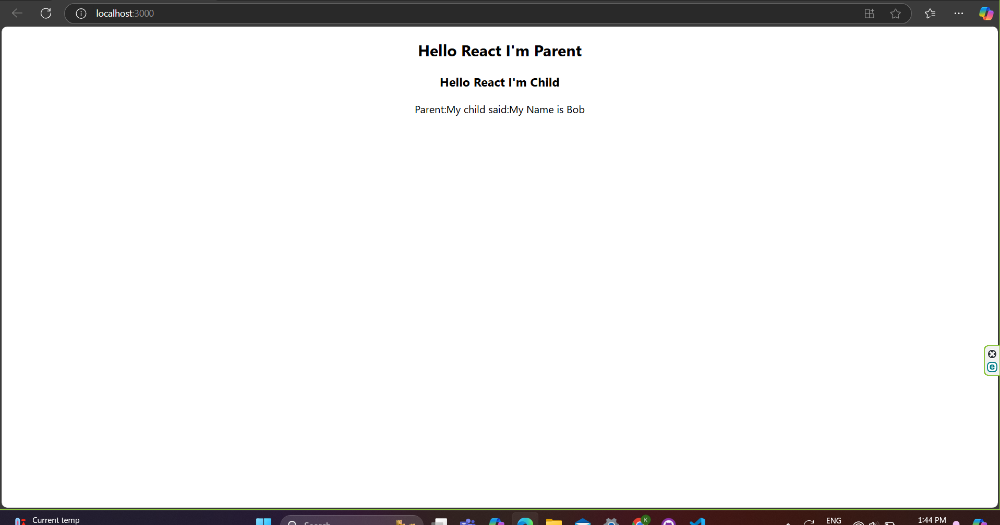

# 2020ICT86 - React Parent-Child Communication Example

This project demonstrates parent-child communication in a React application. The parent component passes props to the child component, and the child component sends data back to the parent.

## Features

- **Parent Component**: Displays a message and receives data from the child component.
- **Child Component**: Displays its own message and sends data back to the parent component.

## Project Structure

### Files Included:

1. **App.css**:
   - Custom styles for the App component, including layout, animations, and responsive design.
   - Contains styles for the `.App-header` and `.App-logo` classes.
   
2. **index.css**:
   - Global styles for the project, such as font settings and base styles for the body and code elements.

3. **App.js** (not provided but assumed):
   - Likely contains the React parent component logic.

4. **ChildComp.js** (not provided but assumed):
   - Likely contains the React child component logic.

## Screenshot



This is how the project looks when rendered. The parent component shows a message and the response from the child component.

## Getting Started

### Prerequisites

- [Node.js](https://nodejs.org/) (Recommended: Latest stable version)
- npm or yarn for package management

### Installation

1. Clone the repository:
   ```bash
   git clone https://github.com/your-username/your-repo-name.git
   cd your-repo-name
